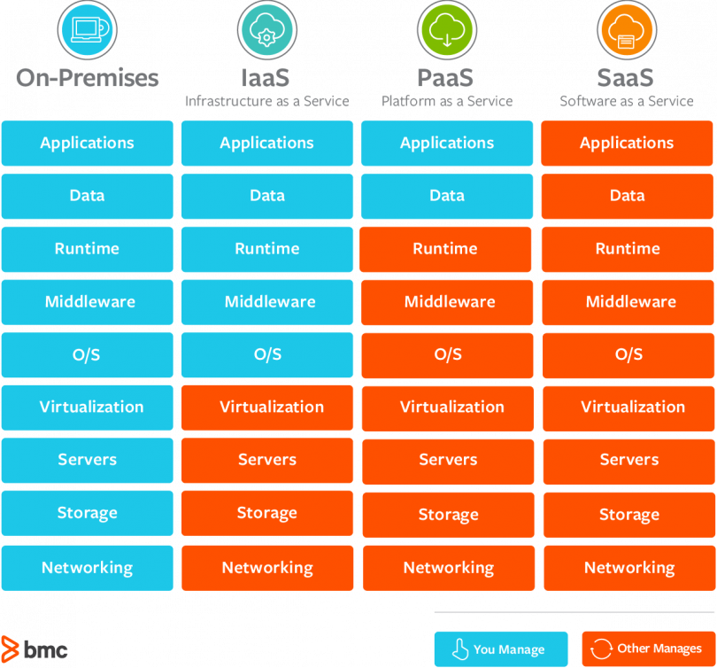

# What is Cloud Computing

- On-demand delivery of IT resources
- Pay as you go model

### How websites work

client ---> network ---> server

For the client to find server and server to find client, they have to have IP addresses.

### What is a server is composed of

CPU + RAM

CPU - compute
RAM - memory

Database: data is stored in a structures way

Network - Routers, switch, DNS servers

Network is a bunch of cables, routers and servers connected with each other

Router - A networking device that forwards data packets between computer networks. They know where to send your packets on the internet.

### Deployment models of the cloud

Private Cloud:

- used by single organisation, not exposed to the public
- complete control
- security for sensitive applications
- meet specific business needs

Public Cloud:

- Owned & operated by 3rd party cloud service provider
- Delivered over the internet

Hybrid Cloud:

- Keep some servers on premises & extend some to the cloud
- Control over sensitive assets

### Five characteristics of Cloud Computing

- On-demand self service
- Broad network access
- Multi-tenancy and resource pooling
- Rapid elasticity and scalability
- Measured service

### Six advantages of Cloud Computing

- Trade capital expence for operational expense
- Benefit from massive economies of scale
- Stop guessing capacity
- Increased speed and agility
- Stop spending money running & maintaining data centers
- Go global in minutes: leverage the AWS global infrastructure

### Types of Cloud Computing

### Examples of Cloud Computing Types

IaaS:

- Amazon EC2
- GCP, Azure, Rackspace, Digital Ocean, Linode

PaaS:

- Elastic Beanstalk
- Heroku, Google App Engine, Windows Azure

SaaS:

- Many AWS services
- Gmail, Dropbox, Zoom

### Pricing of the cloud

3 pricing fundamentals:

Compute:

- Pay for commute time

Storage:

- Pay for data stored in the Cloud

Data transfer OUT of the cloud:

- Data transfer IN is free
