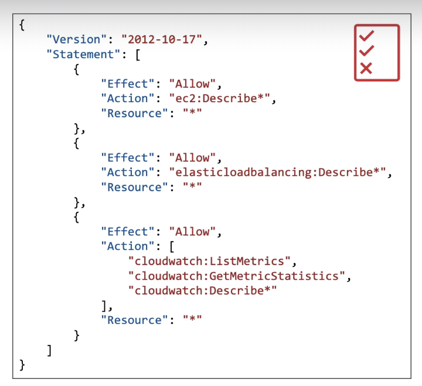

# IAM

- Idenitity & Access maangement
- Global service

Root account - created by default, shouldn't be used or shared

Users - people within organisation, can be grouped. e.g. developers, operations. users can be part of two different groups

Groups - only contain users, not other groups

## Permissions

Users/groups can be assigned JSON documents called policies.

you're trying to make sure everyone only has access to what they need

In AWS - you apply `least privilege principle` - don't give more permissions than a user needs

What this JSON doc looks like:

## IAM users and groups
